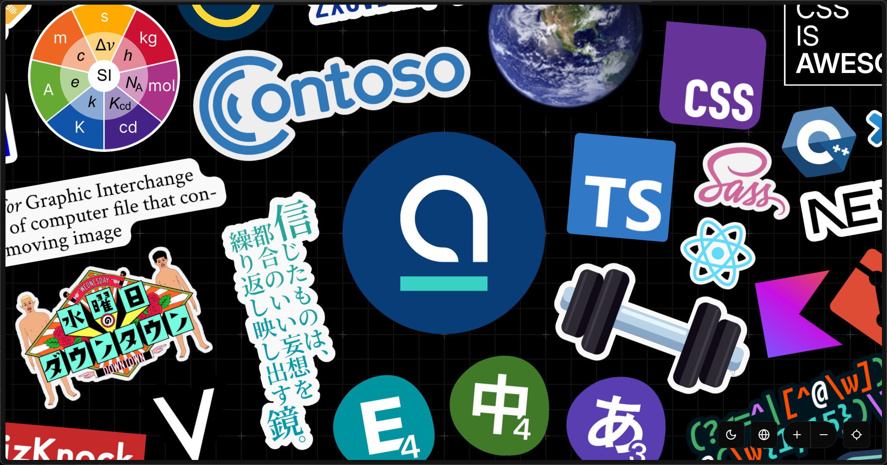

# Sticker Sheet



**Sticker Sheet** is an innovative About-me page, but full of interactive stickers. Create a personalized canvas with stickers that represent your identity, interests, and skills.

## Features

- A sticker canvas with zooming and panning support.
- Dark / light mode
- Fully localizable: name, description, and even stickers themselves
- Dynamic stickers running JavaScript logic
- MDX and React components in descriptions

## Getting Started

### Prerequisites

- Node.js, npm
- Deno

### Installation

1. Clone the repository:
   ```bash
   git clone https://github.com/blueset/sticker-sheet.git
   cd sticker-sheet
   ```

2. Install dependencies:
   ```bash
   npm install
   ```

3. Run the development server:
   ```bash
   npm run dev
   ```

4. Open [http://localhost:3000](http://localhost:3000) in your browser to see the result.

## Adding Your Own Stickers

Stickers are defined in YAML files in the `src/data/stickers` directory.

To add a new sticker:

1. Create a new YAML definition in `src/data/stickers/`
1. Add your sticker image (if any) to `public/stickers/`
1. Compile the main YAML with `deno run --allow-read --allow-write --allow-net ./utils/compileYaml.dts`

Example sticker definition:

```yaml
slug: my-sticker
x: 500
y: 300
width: 200
height: 200
rotation: 10 # degrees clockwise
image: /stickers/my-sticker.svg
title: 
  en: "My Sticker"
  ja: "私のステッカー"
description:
  en: "This is my custom sticker"
  ja: "これは私のカスタムステッカーです"
```

## License

MIT License.
